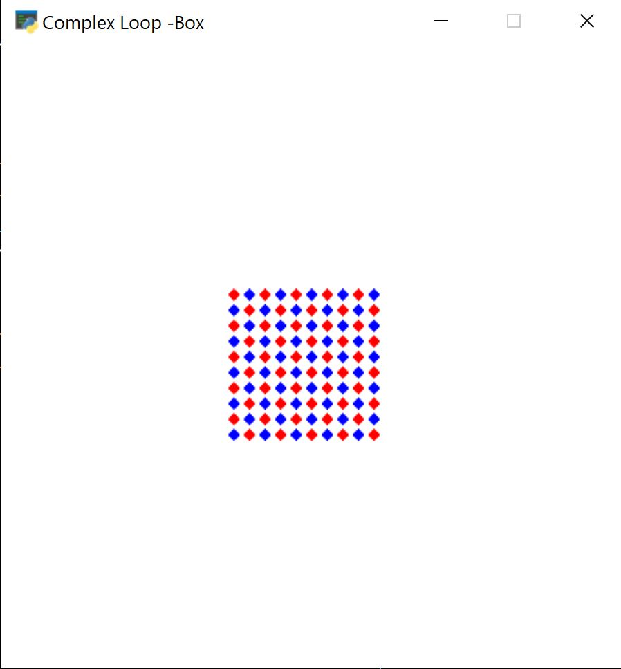

# Assignment 13

In this assignment, 2 problems are solved, first designing the spaceship game and designing the complex loop box.

---

## Assignment 13-1 : Spaceship Game

In this assignment, 3 classes for Spaceship game are defined ( a class for enemy , a class for our spaceship and a class for game) and we use arcade package to design this game. In this game, our space shi can shift the location to the left and to the  right when  a user presses  A and D bottom of keyboard. Also, the enemies can enter the game with a speeed and an angle.


you can run the following code to enjoy it . 


```
python HW13-1_spaceship_game.py
```

## Assignment 13-2 : Complex loop box

In this assignment, we use the object oriented concepts to design a complex loop box. So, 2 classes are defined, one for designing the pattern and the other for designing the board with using the arcade package.

The complex loop box is shown bellow:




you can run the following code to enjoy it . 


```
python HW13-2_complex_loop_box.py
```
