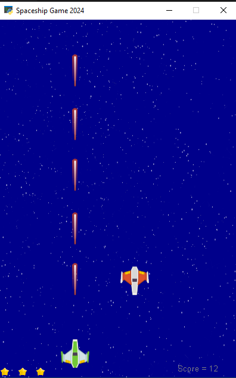

# Assignment 14 

In this assignment, a spaceship game is designed with object oriented concepts. Suppose there is a spaceship in this game, which the user can navigate with the left and right keys, or move the A and D buttons to the left and right of the screen. This spaceship can shoot and destroy enemies that randomly enter the game space with the space button. In this game, three lives are considered for the spaceship, and if the enemy hits the spaceship, one of the lives will be reduced. If the life of the spaceship runs out, the game ends with the game over message. If a shot hits the enemy, the player's scores will be added, and if the enemy enters his planet, the player's points will be reduced by one unit.

This game is coded by python language and arcade package.

A view of the game is shown bellow:



You can run the following code to enjoy it . 

```
python HW14-spaceship_game.py
```