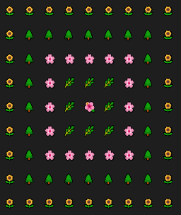

# Assignment 11

In this assignment, 3 classes are developed for fraction, time and complex number and a function is developed to generate a rug.

---

## Assignment 11-1 : Fraction class

In this assignment, a class for Fraction is defined. In this class,In this class, numerator, denominator and a show function (to display a fraction) are  defined as properties and some methods are developed describing below :

1- sum : sum 2 fractions

2- subtract :subtract 2 fractions

3- multiply : multiply 2 fractions 

4- division :divide 2 fractions

5- simply : simplification a fraction

6- to_number : convert a fraction to decimal number


you can run the following code to enjoy it . 


```
python HW11-1_fraction.py
```

## Assignment 11-2 : Time class

In this assignment, a class for Time is defined. hour, minute, second and function modify (for fixing the incorrect time) are  defined as properties and some methods are developed describing below :

1- sum : sum 2 times

2- subtract :subtract 2 times

3- second to time : convert a time in second to hour, minute and second.

4- time to second : convert a time in hour, minute and second to seconds

5- time to tehran : convert a GMT time to Tehran time

6- show : display a time

you can run the following code to enjoy it . 


```
python HW11-2_time.py
```

## Assignment 11-3 : Complex class

In this assignment, a class for Complex number is defined. real and image are defined as properties and some methods are developed describing below :

1- sum : sum 2 complex numbers

2- subtract :subtract 2 complex numbers

3- multiply : multiple 2 complex numbers

4- show : display a complex number

you can run the following code to enjoy it . 


```
python HW11-3_complex.py
```

## Assignment 11-4 : Generate a rug

In this assignment, a function is defined to generate a concentric rug shown below :



you can run the following code to enjoy it . 


```
python HW11-4_rug.py
```
