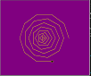

# Assignment 6

---
## Assignment 6 - 5 : Tic Tak Toe

### OBJECTIVE:
This assignment aims to develop a Tic Tac Toe game using python. It mainly consists of developing and implementing a computer program that plays Tic Tac Toe against another player.

In order to understand what Tic Tac Toe game is and how to play the game, below is the description.

### GAME DESCRIPTION:
Tic Tac Toe is a two-player game (one of them being played by computer or human). In this game, there is a board with 3 x 3 squares.

The two players take turns putting marks on a 3x3 board. The goal of Tic Tac Toe game is to be one of the players to get three same symbols in a row - horizontally, vertically or diagonally on a 3 x 3 grid.  The player who first gets 3 of his/her symbols (marks) in a row - vertically, horizontally, or diagonally wins the game, and the other loses the game. 
The game can be played by two players. There are two options for players: (0) Computer (1) Human  

### GAME RULES:
A player can choose between two symbols with his opponent, usual game uses “X” and “O”. 
1.	The player that gets to play first will get the "X" mark (we call him/her player 1) and the player that gets to play second will get the "O" mark (we call him/her player 2).

2.	Player 1 and 2 take turns making moves with Player 1 playing mark “X” and Player 2 playing mark “O”.

3.	A player marks any of the 3x3 squares with his mark (“X” or “O”) and their aim is to create a straight line horizontally, vertically or diagonally with two intensions:
a.	One of the players gets three of his/her marks in a row (vertically, horizontally, or diagonally) i.e. that player wins the game. 
b.	If no one can create a straight line with their own mark and all the positions on the board are occupied, then the game ends in a  draw/tie.

You can run '''HW6-5_Tik Tak Toe.py'''  to enjoy it.

---

## Assignment 6 - 6 :Graph with Turtle
In this assignment, turtle packge is used for drawing a nested graph like a below figure

You can run '''HW6-6_Turtle.py'''  to enjoy it.

---
## Assignment 6 - 7 : Solve cubic equation 

In this assignment, the coefficients of cubic equation are entered by user and this code prints the roots of this equation.

You can run '''HW6-7_equation3.py'''  to enjoy it.